# PCB Defect Detection
## Design Assumptions:

The project will utilize ready-made datasets containing graphics of typical PCB defects (Justify the dataset selection).  

Prepare, augment, and normalize data for the model.  

Model selection and preparation, justification of the decision, presentation of comparisons between models. Metrics and other desired measured values.  

Preparation of a GUI application for presenting results.  

Preparation of a presentation describing the process.  

## Dataset Selection:

[Dataset Link - option 1](https://www.kaggle.com/datasets/norbertelter/pcb-defect-dataset/data)
[Dataset Link - option 2](https://www.kaggle.com/datasets/akhatova/pcb-defects)

We focused on two datasets we found. Ultimately, however, we decided that option 1 would be more advantageous for our project. Both sets divided defects into six classes: 
- missing hole,
- mouse bite,
- open circuit,
- short,
- spur,
- spurious copper.  

 However, the set we selected, in addition to identifying the appropriate error category, also included information about the location of the bounding box—the position of the defect on the PCB. We consider this a significant advantage over option 2. Another important advantage of our preferred option was that the data was already augmented (easier data preprocessing; normalization remains). The second set, on the other hand, was based on graphics representing entire boards, not just zoomed-in fragments like set 1, but this advantage wasn't sufficient to forgo the other benefits.  

The augmented dataset contains 10668 images and the corresponding annotation files.
The data has enough images to train our model to detect defects, and if we are not focused on the percentage maxing it should be good choice. The quality of dataset is great and the resolution satisfies our needs.  

## Data Preprocessing

Data was already augmented. We have normalized data for our model, by changing picture size to 160x160 pixels for first tests and 320x320 in next versions.

## Model

Model was trained based on YOLO from Ultralytics. We checked three versions: YOLOv5nu, YOLOv8, YOLO11n. The tests also included experimenting with the size of graphics (normalization), dataset, and preprocessing (full color, grayscale, binary).  

We chose YOLO because it allows for a simple implementation of simultaneous detection and classification. As part of the project, we also attempted to develop a model from scratch, but encountered problems combining these features.

Examples of the obtained metrics are presented below:

### Model YOLOv8nu - epochs=10, image size=160:

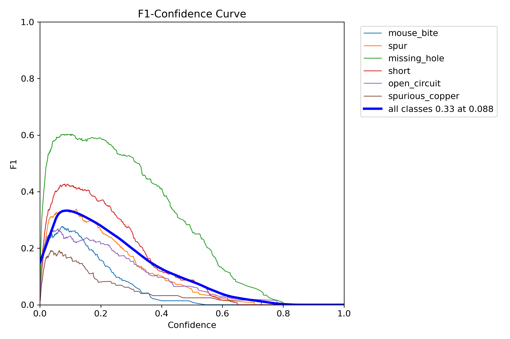

### Model YOLOv8n - epochs=10, image size=320:

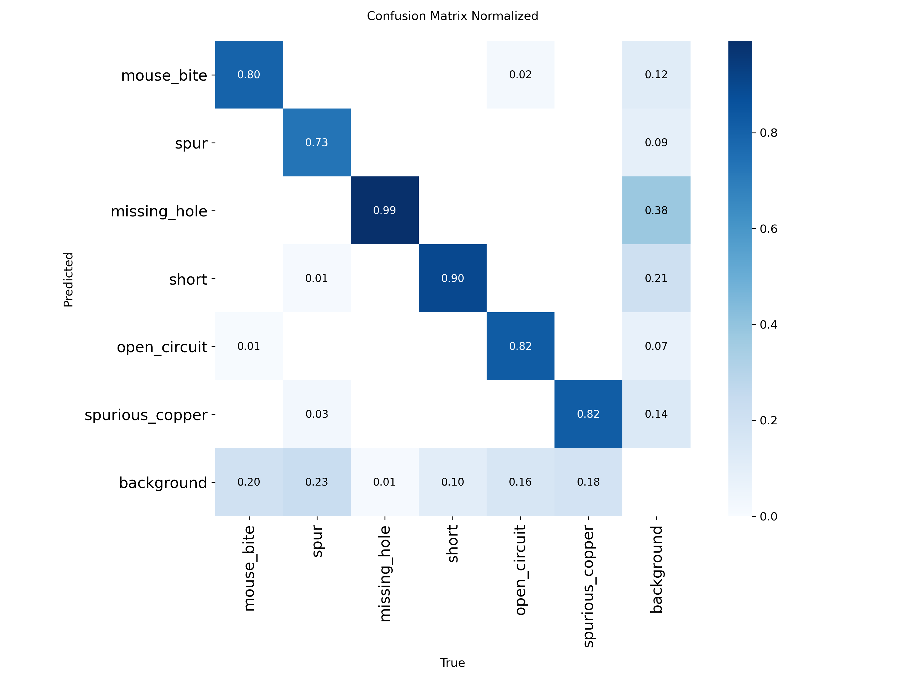
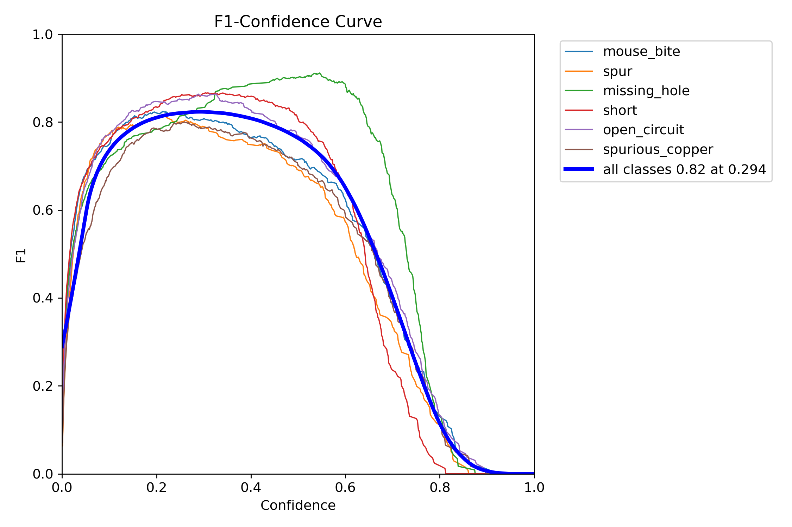
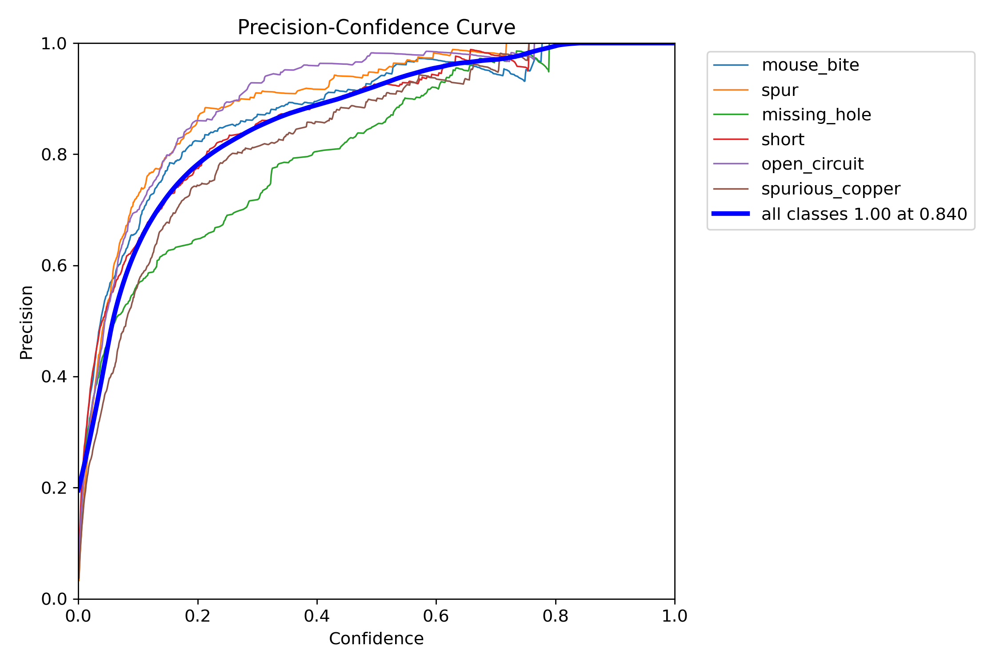

### Model YOLO11n - epochs=10, image size=320:

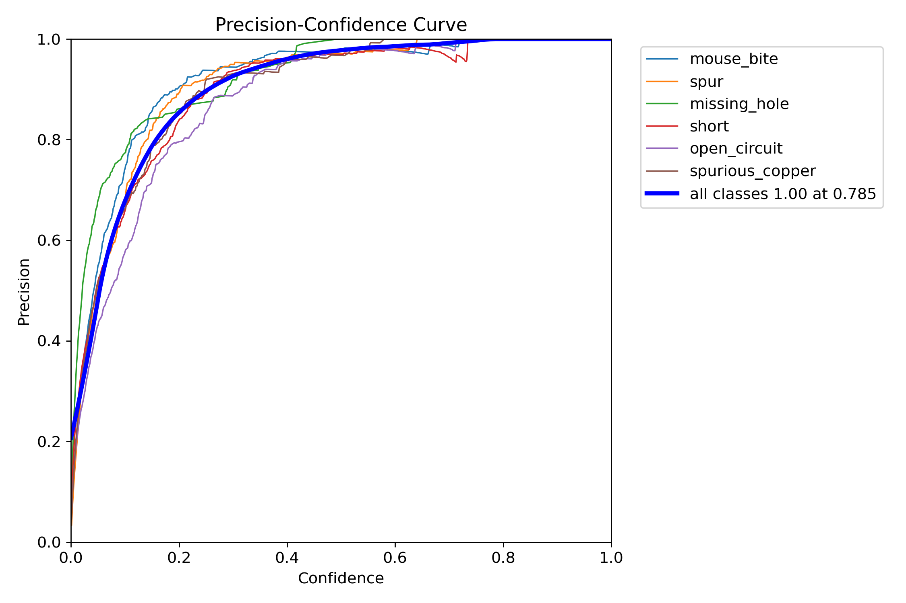

### Model YOLO11n - epochs=10, image size=320, reduced dataset:

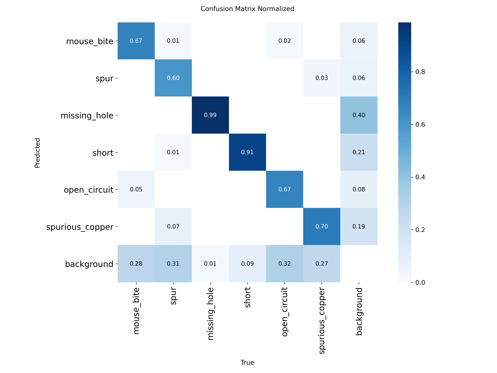
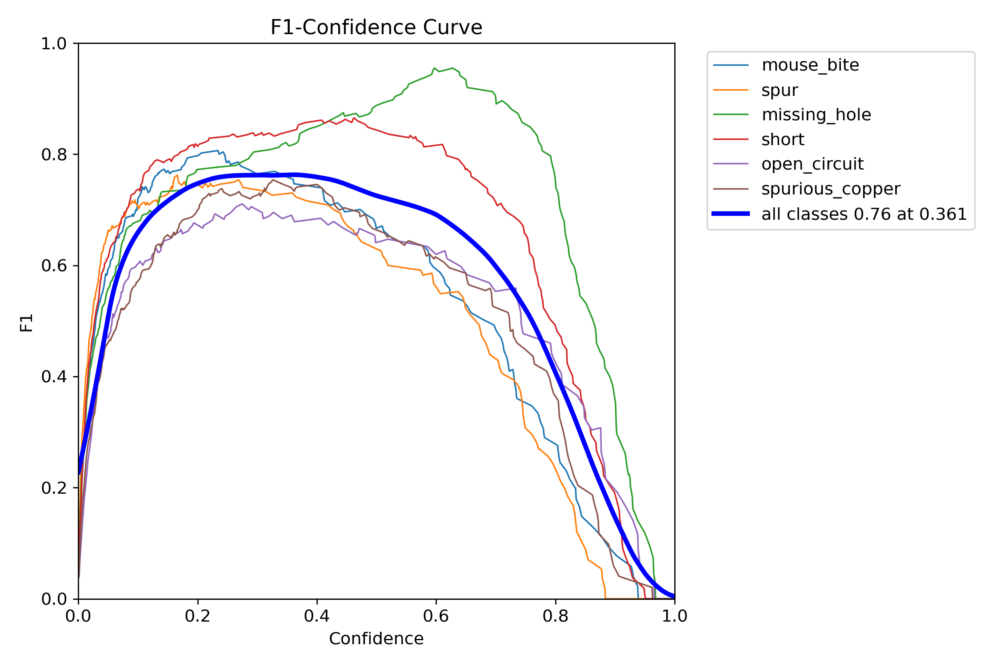
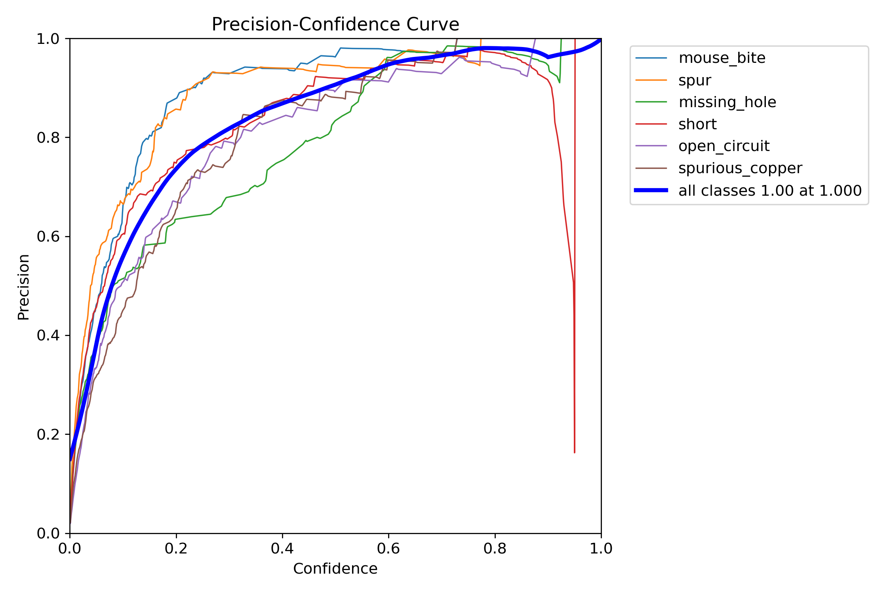

### Model YOLO11n - epochs=10, image size=320, grayscale:

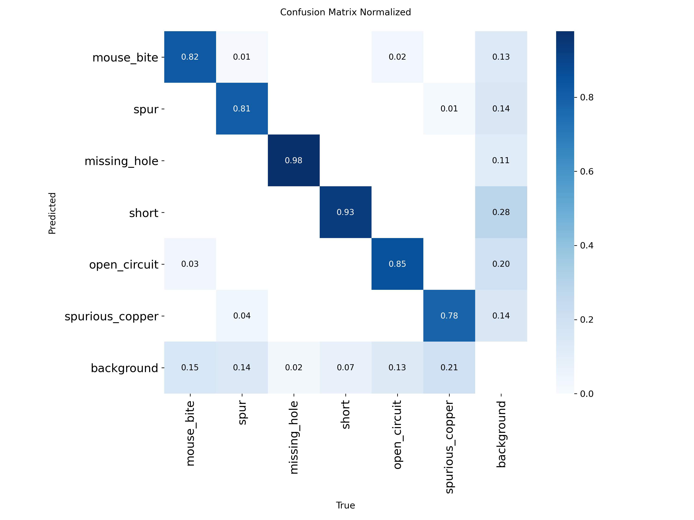
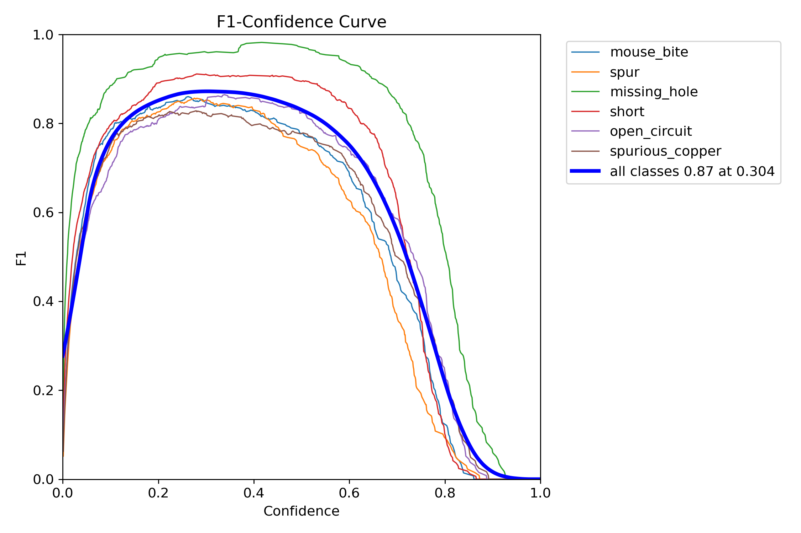
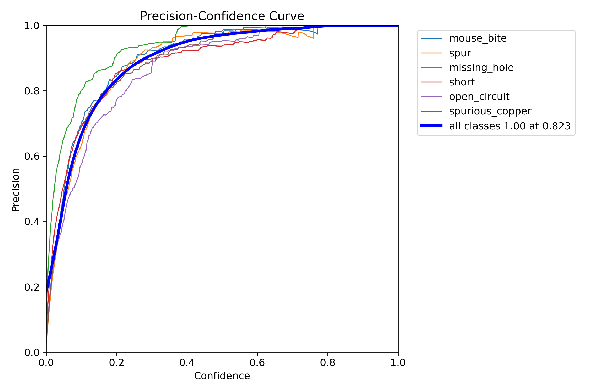

### Model YOLO11n - epochs=10, image size=320, binary treshold:

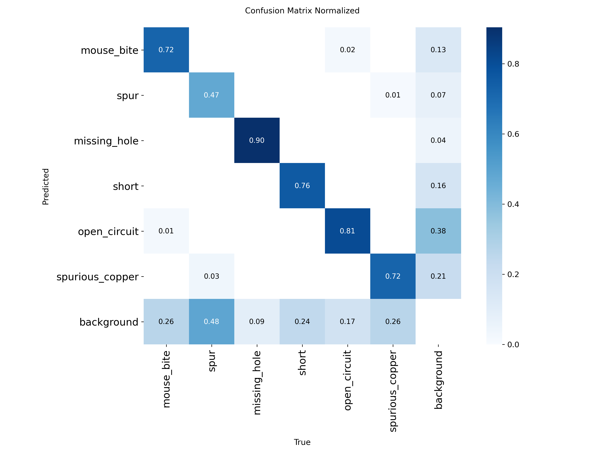
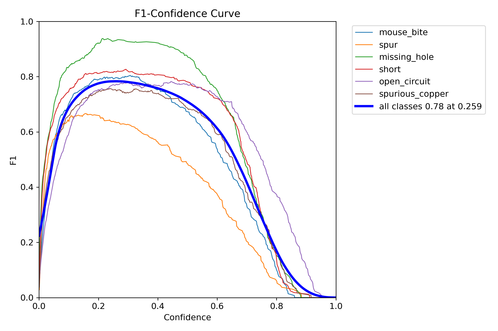
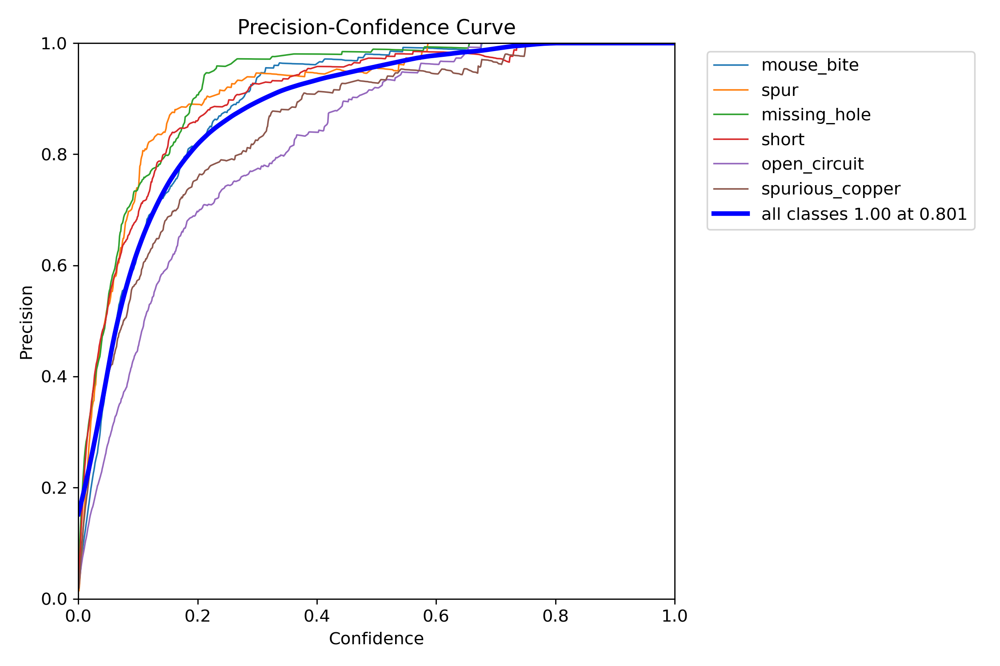

### Wnioski:

## GUI

The GUI, like the model, is prepared in a Python environment; we use the PyQT5 library for the GUI. The main purpose of the GUI is to load an image to classify potential defects and identify their location on the PCB.